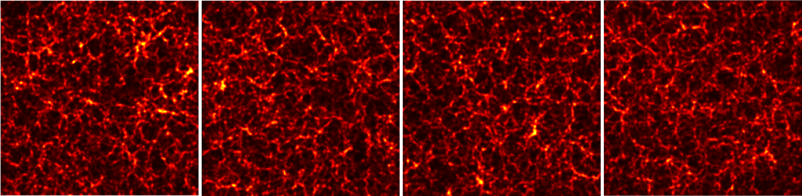

# nuGAN: Neutrino-Conditioned Wasserstein GAN for Cosmological Maps




This is a **PyTorch implementation of a conditional Wasserstein GAN (WGAN-GP)** designed to generate high-dimensional cosmological maps conditioned on neutrino masses. The training pipeline supports spectral loss regularization, gradient penalty, multi-GPU training, and flexible optimization schedules.

---

## Overview

The main training script (`train.py`) trains a neutrino-conditioned GAN that:
- Learns from 2D cosmological density maps
- Conditions generation on neutrino mass parameters
- Uses Wasserstein loss with gradient penalty
- Incorporates a power-spectrum–based spectral loss
- Saves best models based on multiple criteria (G loss, G+D loss, power spectrum loss)

---

## Repository Structure

```text
.
├── train.py        # Main training script
├── utils.py        # Helper utilities
├── models.py       # Generator and Critic architectures
├── run.sh          # Example shell script for running training script
├── README.md

```

## Requirements

The recommended way to set up the environment is using the provided Conda environment file.
```bash
conda env create -f env.yml
conda activate nugan
```

## Run

Modify train params inside run.sh. Run as `bash run.sh`

During training, the following directories are created inside save_path:
```text

save_path/
├── saved_models/
│   ├── best_model_on_G_loss.pt
│   ├── best_model_on_GD_loss.pt
│   ├── best_model_on_pk_loss.pt
│   └── model_epoch_*.pt
├── saved_losses/
│   ├── G_losses.csv
│   ├── D_losses.csv
│   ├── D_losses_real.csv
│   ├── D_losses_fake.csv
│   └── pk_losses.csv
├── saved_data/
│   └── img_list.npy
└── args.txt
```

## Improvements

- Critic contains `BatchNorm` unlike standard WGAN practice.
- Critic is updated using Wasserstein loss with gradient penalty and spectral loss.

- Critic gradients are clipped

- Spectral loss is enabled after an initial warm-up period (default: 5000 iterations).

- Generator updates can be controlled via:
    - `G_update_interval` is the number of times the Critic is updated for each update in Generator.
    - `G_update_freq` is the number of times the Generator is updated for each update in Critic.
    - One of the above must be `0` when the other is not.

- Neutrino masses are used to condition both the Generator and the Critic. They are concatenated `mchn` times at the start and the end of the 1-D latent vector `nz`.

- Fixed noise and conditioning vectors are used for periodic sample generation.

- Checkpoints are saved based on lowest running losses on Generator, Generator+Critic, and the average binned P(k) loss between real and fake data batches of `G_samples` samples.